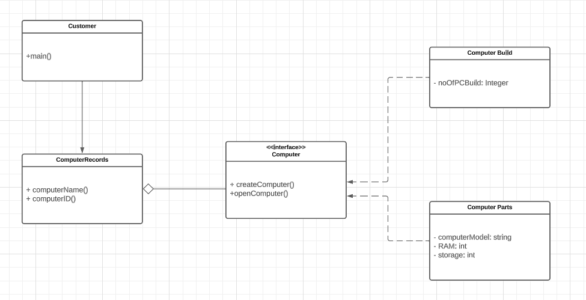

## Problem Scenario
Implement factory design pattern using Computer as the factory interface. The interface implements two methods: createComputer() and openComputer().

ComputerBuild and ComputerParts are concrete objects that implements Computer interface.

ComputerRecords holds attributes such as computerName, computerID, and Computer.

Customer would be the client object.

Refer to the UML Class Diagram

## UML Class Diagram

